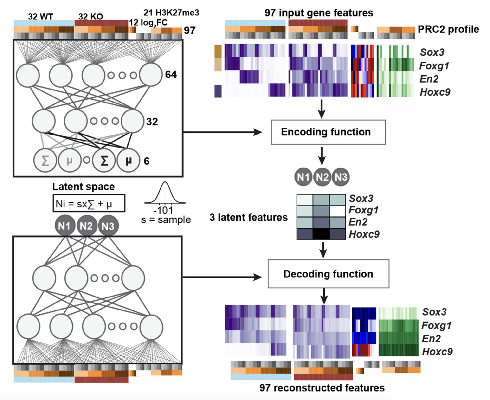
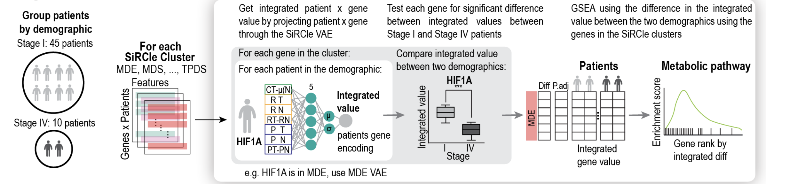

# scivae

1. [docs](https://arianemora.github.io/scivae/)
2. [paper](https://doi.org/10.1093/nar/gkac006)

## Install 

```
conda create --name scivae python==3.8.20
pip install scivae
```

**Note there is an issue with python 3.10 which idk why**

## Run 

Quickstart example:

```
from scivae import *
import numpy as np
import matplotlib.pyplot as plt

numpy_array = np.random.rand(100, 30)
labels = np.ones(100)

config = {'scale_data': False, # Whether to min max scale your data VAEs work best when data is pre-normalised & outliers removed for trainiing
           'batch_norm': True, 
           'loss': {'loss_type': 'mse', # mean squared error
           'distance_metric': 'mmd', # Maximum mean discrepency (can use kl but it works worse)
           'mmd_weight': 1}, # Weight of mmd vs mse - basically having this > 1 will weigh making it normally distributed higher
           # and making it < 1 will make reconstruction better.
           'encoding': {'layers': [{'num_nodes': 32, 'activation_fn': 'selu'}, # First layer of encoding
                                  {'num_nodes': 16, 'activation_fn': 'selu'}]}, # Second layer of encoding
           'decoding': {'layers': [{'num_nodes': 16, 'activation_fn': 'selu'},  # First layer of decoding
                                  {'num_nodes': 32, 'activation_fn': 'selu'}]}, # Second layer of decoding 
 'latent': {'num_nodes': 2}, 'optimiser': {'params': {}, 'name': 'adam'}} # Empty params means use default

vae_mse = VAE(numpy_array, numpy_array, labels, config, 'vae_label')
# Set batch size and number of epochs
vae_mse.encode('default', epochs=500, batch_size=50, early_stop=True)
encoded_data_vae_mse = vae_mse.get_encoded_data()

print(encoded_data_vae_mse[0])

plt.scatter(encoded_data_vae_mse[:,0], encoded_data_vae_mse[:,1])
```

## Uses 
I've used this for my own research in the following two publications:

1. [SiRCle (Signature Regulatory Clustering) model integration reveals mechanisms of phenotype regulation in renal cancer](https://www.biorxiv.org/content/10.1101/2022.07.02.498058v1.abstract)
2. [Variational autoencoding of gene landscapes during mouse CNS development uncovers layered roles of Polycomb Repressor Complex 2](https://doi.org/10.1093/nar/gkac006)

### Example 1: integration of ChIP-seq and RNA-seq data for embryonic mouse brain development


### Example 2: pseudo statistics for kidney cancer integration across DNA methylation, gene expression and protein abundance


### Documentation 

It is very easy to call the basic VAE. Simply install the package (or raw code). Then you need to setup 
a config dictionary. This is pretty self explanatory. 

```
from scivae import *
```

    - loss: loss dictionary see Loss class for input details
    - encoding: a dictionary of encoding layers, number of nodes and activation function
    - decoding: same as above but for decoding layers
    - latent: configs for latent space. See (def optimiser(self, optimiser_name: str, params: dict):) in vae.py for details

```

config = {'scale_data': False, # Whether to min max scale your data VAEs work best when data is pre-normalised & outliers removed for trainiing
           'batch_norm': True, 
          'loss': {'loss_type': 'mse', # mean squared error
           'distance_metric': 'mmd', # Maximum mean discrepency (can use kl but it works worse)
            'mmd_weight': 1}, # Weight of mmd vs mse - basically having this > 1 will weigh making it normally distributed higher
            # and making it < 1 will make reconstruction better.
          'encoding': {'layers': [{'num_nodes': 32, 'activation_fn': 'selu'}, # First layer of encoding
                                  {'num_nodes': 16, 'activation_fn': 'selu'}]}, # Second layer of encoding
          'decoding': {'layers': [{'num_nodes': 16, 'activation_fn': 'selu'},  # First layer of decoding
                                  {'num_nodes': 32, 'activation_fn': 'selu'}]}, # Second layer of decoding 
 'latent': {'num_nodes': 2}, 'optimiser': {'params': {}, 'name': 'adam'}} # Empty params means use default

```

Run the VAE. Numeric data is expected to follow an approximately normal distribution (each column).
It expects a numpy array with each row being a list of features corresponding to some label. Labels mean nothing - 
they just need to be a list of the same size - these are just used for downstream analyses (e.g. colouring).

Note for most configs we want input_data = output_data however I have left this modular so we can upgrade to having 
it be denoising etc in the future.
```
vae_mse = VAE(numpy_array, numpy_array, labels, config, 'vae_label')
# Set batch size and number of epochs
vae_mse.encode('default', epochs=500, batch_size=50, early_stop=True)
encoded_data_vae_mse = vae_mse.get_encoded_data()
``` 
The VAE can also be used to encode new data.
```
# note this all needs to be normalised like you normalised the training data
new_data_encoded = vae_mse.encode_new_data(some_new_np_array) # i.e. with your outliers in
```

Visualisation is the same as if we got back the PCs from PCA. i.e. the below code will plot a scatter plot of the first 
and second latent nodes.

```
plt.scatter(encoded_data_vae_mse[:,0], encoded_data_vae_mse[:,1])
```


## Other info
scivae is a wrapper around the keras AE that allows you to build/save/visualise with a variational autoencoder.

Blogs & notebooks used as references are noted in the code and a couple at the end of this README.

The primary difference between a VAE and a normal AE is in how the loss function is computed. Here the loss 
has been abstracted out to the loss class (in *loss.py*) where we can use a number of loss metrics MMD, KL and combine this with 
MSE or COR loss.

The VAE (in *vae.py*) class has the general VAE structure.

Saving has been implemented of the VAE state so that you can re-use your trained model on the same data and get 
the same latent space (or use the trained VAE on new data).  

Optimiser was a temporary deviation where we can pass in a VAE structure and using an evolutionary algorithm the 
optimisation class will try to get the best VAE structure. This will be returned.

Validate allows for running simple validations using scikitlearn i.e. if your primary interest is to get a meaningful
 latent space that captures the key features of the dataset, it can be good to compare how much "information" has 
 been captured between your classes. A good way of measuring this is by passing through the latent space and a set 
 of labels and seeing if a simple classifier can distingush your classes better than with the raw data.

## Users

Works on mac and ubuntu, no tests on windows.

If you have issues with install, download the `requirements.txt` file and install the exact packages:

Make sure you are using **python 3.8!**

```
pip install -r requirements.txt
```

## Tests
See tests for further examples.

## References

1. https://github.com/pren1/keras-MMD-Variational-Autoencoder/blob/master/Keras_MMD_Variational_Autoencoder.ipynb
2. https://github.com/s-omranpour/X-VAE-keras/blob/master/VAE/VAE_MMD.ipynb
3. https://github.com/ShengjiaZhao/MMD-Variational-Autoencoder/blob/master/mmd_vae.py
4. https://github.com/CancerAI-CL/IntegrativeVAEs/blob/master/code/models/mmvae.py